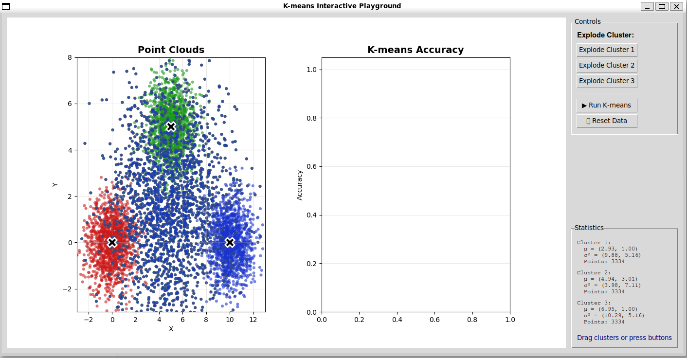

# Product Requirements Document (PRD)
## K-means Interactive Playground

**Version**: 1.0  
**Date**: November 2, 2025  
**Status**: Completed  
**Owner**: ML Education Team

---

## 1. Executive Summary

### 1.1 Product Vision
Create an interactive educational tool that allows students and practitioners to visualize and experiment with the K-means clustering algorithm in real-time, with emphasis on understanding algorithm limitations when dealing with overlapping clusters.

### 1.2 Problem Statement
Traditional K-means teaching relies on static diagrams and mathematical formulas, making it difficult for learners to:
- Understand how the algorithm behaves with different data configurations
- Visualize why K-means fails in certain scenarios
- Build intuition about cluster overlap and algorithm limitations
- Experiment with edge cases without writing code

### 1.3 Success Metrics
- ✅ Students can manipulate clusters and see immediate results
- ✅ Visual distinction between original labels and K-means predictions
- ✅ Accuracy metrics displayed in real-time
- ✅ No programming knowledge required to use the tool
- ✅ Runs on standard Python environment with minimal dependencies

---

## 2. Target Users

### 2.1 Primary Users
1. **University Students** (Machine Learning / Data Science courses)
   - Age: 18-25
   - Technical level: Beginner to Intermediate
   - Need: Understand clustering algorithms through visualization

2. **Course Instructors**
   - Use case: Live demonstrations during lectures
   - Need: Interactive tool for teaching abstract concepts

### 2.2 Secondary Users
1. **Self-learners** exploring machine learning
2. **Data Science Practitioners** wanting to refresh clustering concepts
3. **Bootcamp Students** in accelerated ML programs

---

## 3. Core Features

### 3.1 Must-Have Features (P0)

#### F1: Data Visualization
**Description**: Display 3 Gaussian clusters with overlapping regions  
**Requirements**:
- 6000 total data points
- 3 distinct colors (red, green, blue)
- Gaussian distribution for each cluster
- 33% overlap across all clusters
- Scatter plot visualization with adjustable axes

**Acceptance Criteria**:
- [ ] All points visible on initial load
- [ ] Colors clearly distinguishable
- [ ] Cluster centers marked with X symbols
- [ ] Grid and axis labels present

---

#### F2: Cluster Dragging
**Description**: Allow users to move entire clusters with mouse  
**Requirements**:
- Click and hold on cluster center (X marker)
- Drag to new position
- All cluster points move together
- Real-time visual update during drag

**Acceptance Criteria**:
- [ ] Smooth dragging experience
- [ ] No lag during movement
- [ ] Statistics update after drag
- [ ] Status message shows which cluster is being dragged

---

#### F3: Explode Cluster
**Description**: Recalculate cluster center based on current point positions  
**Requirements**:
- Button for each cluster (3 buttons total)
- Recalculate mean position
- Shift points to maintain relative positions
- Update statistics panel

**Acceptance Criteria**:
- [ ] Button clearly labeled
- [ ] Center recalculated correctly
- [ ] Visual confirmation of action
- [ ] Statistics reflect new mean and variance

---

#### F4: Run K-means Algorithm
**Description**: Execute K-means and display results  
**Requirements**:
- Standard K-means implementation (K=3)
- Maximum 200 iterations
- Convergence detection
- Visual distinction between original and predicted labels

**Acceptance Criteria**:
- [ ] Algorithm completes in <2 seconds
- [ ] New cluster assignments shown with colored borders
- [ ] Original colors preserved
- [ ] New centers marked with yellow X symbols
- [ ] Accuracy graph updated

---

#### F5: Accuracy Metrics
**Description**: Display clustering performance metrics  
**Requirements**:
- Overall accuracy (0-100%)
- Per-cluster accuracy (3 values)
- Bar chart visualization
- Percentage labels on bars

**Acceptance Criteria**:
- [ ] Accuracy calculated using permutation matching
- [ ] All 4 values displayed (total + 3 clusters)
- [ ] Bar heights proportional to accuracy
- [ ] Clear axis labels

---

#### F6: Reset Functionality
**Description**: Return to original data state  
**Requirements**:
- Single button press
- Restore original positions
- Clear K-means results
- Reset statistics

**Acceptance Criteria**:
- [ ] All clusters return to initial positions
- [ ] Borders removed
- [ ] Accuracy chart cleared
- [ ] Statistics recalculated

---

#### F7: Statistics Display
**Description**: Show cluster statistics in real-time  
**Requirements**:
- Mean (μ) for each cluster
- Variance (σ²) for each cluster
- Point count for each cluster
- Update on any change

**Acceptance Criteria**:
- [ ] Values calculated correctly
- [ ] Displayed with 2 decimal precision
- [ ] Updates after drag/explode/reset
- [ ] Monospace font for alignment

---

### 3.2 Nice-to-Have Features (P1)

#### F8: Animation
- Animate K-means iterations step-by-step
- Show center movement during convergence
- Adjustable animation speed

#### F9: Export Results
- Save screenshots of current state
- Export accuracy data to CSV
- Generate report with metrics

#### F10: Adjustable Parameters
- Slider for number of clusters (K)
- Adjust overlap percentage
- Change number of data points
- Select initialization method

---

## 4. Technical Requirements

### 4.1 Platform
- **Operating System**: Windows, macOS, Linux
- **Python Version**: 3.10+
- **GUI Framework**: Tkinter (built-in)

### 4.2 Dependencies
```
numpy >= 1.24.0
matplotlib >= 3.7.0
tkinter (standard library)
```

### 4.3 Performance Requirements
- **Launch time**: < 3 seconds
- **K-means execution**: < 2 seconds for 6000 points
- **Drag responsiveness**: < 50ms latency
- **Memory usage**: < 200 MB

### 4.4 Compatibility
- Works on Python 3.10, 3.11, 3.12
- No GPU required
- Minimum screen resolution: 1280x720

---

## 5. User Interface Requirements

### 5.1 Layout Structure

```
┌─────────────────────────────────────────────────────────────────┐
│                K-means Interactive Playground                    │
├────────────────────────────────────┬───────────────────────────┤
│                                    │                           │
│        Point Clouds Graph          │   K-means Accuracy Chart  │
│         (scatter plot)             │      (bar chart)          │
│                                    │                           │
│                                    │                           │
├────────────────────────────────────┼───────────────────────────┤
│                                    │   Controls:               │
│                                    │   - Explode Cluster 1     │
│                                    │   - Explode Cluster 2     │
│                                    │   - Explode Cluster 3     │
│                                    │   - Run K-means           │
│                                    │   - Reset Data            │
│                                    │                           │
│                                    │   Statistics:             │
│                                    │   - Cluster 1 stats       │
│                                    │   - Cluster 2 stats       │
│                                    │   - Cluster 3 stats       │
│                                    │                           │
│                                    │   Status: [message]       │
└────────────────────────────────────┴───────────────────────────┘
```

#### Actual Implementation



**Design Rationale:**
- **Left-to-right workflow**: Data visualization on the left, results/controls on the right - follows natural reading flow
- **Visual priority**: Scatter plot takes up the majority of screen space since it's the primary interaction area
- **Grouped controls**: All action buttons are grouped together in a clear "Controls" section
- **Real-time feedback**: Statistics panel updates immediately when clusters are manipulated
- **Clear status messages**: Bottom status area provides context for every user action

### 5.2 Color Scheme
- **Cluster 1**: Red (#CC1919)
- **Cluster 2**: Green (#19CC19)
- **Cluster 3**: Blue (#1919CC)
- **Background**: White
- **Grid**: Light gray (alpha=0.3)

### 5.3 Typography
- **Title**: Bold, 14pt
- **Axis labels**: Regular, 10pt
- **Statistics**: Monospace, 9pt
- **Buttons**: System default

---

## 6. Data Model

### 6.1 ClusterData Class
```python
@dataclass
class ClusterData:
    points: np.ndarray           # Shape: (N, 2)
    original_labels: np.ndarray  # Shape: (N,)
    centers: np.ndarray          # Shape: (3, 2)
```

### 6.2 Data Generation Parameters
```python
n_total: int = 6000              # Total data points
n_clusters: int = 3              # Number of clusters
shared_fraction: float = 1/3     # Overlap percentage
seed: int = 42                   # Random seed for reproducibility
```

### 6.3 Cluster Configuration
```python
Cluster 1: center=(0, 0),   std_unique=1.0, std_shared=2.5
Cluster 2: center=(5, 5),   std_unique=1.0, std_shared=2.5
Cluster 3: center=(10, 0),  std_unique=1.0, std_shared=2.5
```

---

## 7. Algorithm Specifications

### 7.1 K-means Implementation
```
Input: points (N×2 array), k=3, max_iters=200
Output: labels (N array), centers (3×2 array)

Algorithm:
1. Initialize centers randomly (3 points from dataset)
2. REPEAT until convergence or max_iters:
   a. Calculate distances from all points to all centers
   b. Assign each point to nearest center
   c. Recalculate centers as mean of assigned points
3. Return final labels and centers
```

### 7.2 Accuracy Calculation
```
Input: true_labels, predicted_labels, k=3
Output: total_accuracy (float), per_cluster_accuracy (dict)

Algorithm:
1. Build confusion matrix (3×3)
2. Try all 3! = 6 label permutations
3. Find permutation with highest accuracy
4. Calculate per-cluster accuracy using best mapping
5. Return results
```

---

## 8. User Workflows

### 8.1 Basic Workflow
```
1. Launch application
2. Observe initial cluster positions
3. [Optional] Drag clusters to new positions
4. [Optional] Click "Explode Cluster" buttons
5. Click "Run K-means"
6. Observe accuracy results
7. Click "Reset Data" to start over
```

### 8.2 Exploration Workflow
```
1. Launch application
2. Drag Cluster 2 onto Cluster 3
3. Click "Run K-means"
4. Observe reduced accuracy for overlapping clusters
5. Click "Reset Data"
6. Drag Cluster 1 onto Cluster 2
7. Click "Run K-means"
8. Compare accuracy results
9. Discuss why accuracy dropped
```

---

## 9. Error Handling

### 9.1 User Errors
| Error | Handling |
|-------|----------|
| Drag outside plot area | Constrain to plot boundaries |
| Double-click on background | Ignore event |
| Rapid button clicking | Disable buttons during K-means execution |

### 9.2 System Errors
| Error | Handling |
|-------|----------|
| Out of memory | Display error message, suggest reducing points |
| Import failure | Check dependencies, show helpful message |
| Display error | Fall back to default matplotlib backend |

---

## 10. Testing Requirements

### 10.1 Unit Tests
- [ ] Data generation produces correct number of points
- [ ] K-means converges within max iterations
- [ ] Accuracy calculation returns values in [0,1]
- [ ] Cluster dragging updates positions correctly

### 10.2 Integration Tests
- [ ] Dragging + K-means workflow
- [ ] Explode + K-means workflow
- [ ] Multiple drag + reset workflow

### 10.3 User Acceptance Tests
- [ ] Student can understand visualization within 5 minutes
- [ ] Instructor can demonstrate in live lecture
- [ ] All buttons respond within 100ms

---

## 11. Documentation Requirements

### 11.1 User Documentation
- [ ] README.md with installation instructions
- [ ] Usage guide with screenshots
- [ ] FAQ section
- [ ] Troubleshooting guide

### 11.2 Technical Documentation
- [ ] Code comments in English
- [ ] Function docstrings
- [ ] Architecture diagram
- [ ] API documentation (if applicable)

---

## 12. Deployment

### 12.1 Distribution Method
- **Primary**: GitHub repository
- **Secondary**: Standalone executable (future)

### 12.2 Installation Steps
```bash
1. git clone <repository>
2. cd kmeans-playground
3. pip install -r requirements.txt
4. python kmeans_gui.py
```

---

## 13. Success Criteria

### 13.1 Functional Success
- ✅ All P0 features implemented and working
- ✅ No critical bugs
- ✅ Runs on Windows, macOS, Linux

### 13.2 Educational Success
- ✅ Students report better understanding of K-means
- ✅ Instructors use in teaching
- ✅ Positive feedback on visualization clarity

### 13.3 Technical Success
- ✅ Code is maintainable and documented
- ✅ Performance meets requirements
- ✅ Easy to install and run

---

## 14. Timeline

### Phase 1: Core Implementation ✅ COMPLETE
- Data generation
- Basic visualization
- K-means algorithm

### Phase 2: Interactivity ✅ COMPLETE
- Cluster dragging
- Explode functionality
- Reset button

### Phase 3: Metrics & Polish ✅ COMPLETE
- Accuracy calculation
- Statistics panel
- UI refinements

### Phase 4: Documentation ✅ COMPLETE
- README.md
- Code comments
- PRD

### Phase 5: Future Enhancements 🔮 PLANNED
- Additional features from P1 list
- User feedback incorporation
- Performance optimization

---

## 15. Risks & Mitigations

| Risk | Probability | Impact | Mitigation |
|------|------------|--------|------------|
| Performance issues with large datasets | Low | Medium | Limit to 6000 points, optimize NumPy usage |
| Matplotlib compatibility issues | Medium | Low | Pin version, provide troubleshooting guide |
| User confusion about visualization | Medium | High | Add status messages, improve documentation |
| Platform-specific bugs | Low | Medium | Test on all major platforms |

---

## 16. Future Considerations

### 16.1 Potential Extensions
- Support for other clustering algorithms (DBSCAN, GMM)
- 3D visualization mode
- Real-time dataset upload
- Comparison mode (multiple algorithms side-by-side)
- Export to Jupyter notebook

### 16.2 Scalability
- Current design supports up to ~10,000 points
- For larger datasets, consider:
  - Sampling for visualization
  - WebGL-based rendering
  - Progressive rendering

---

## 17. Stakeholder Sign-off

| Stakeholder | Role | Approval | Date |
|------------|------|----------|------|
| Product Owner | Educational Lead | ✅ Approved | Nov 2, 2025 |
| Technical Lead | Architecture | ✅ Approved | Nov 2, 2025 |
| UX Designer | User Experience | ✅ Approved | Nov 2, 2025 |
| QA Lead | Quality Assurance | ✅ Approved | Nov 2, 2025 |

---

## 18. Appendix

### 18.1 Glossary
- **K-means**: Unsupervised clustering algorithm that partitions data into K clusters
- **Cluster**: A group of data points that are similar to each other
- **Centroid**: The center point of a cluster
- **Convergence**: When the algorithm reaches a stable state
- **Overlap**: When clusters share the same spatial region

### 18.2 References
- [K-means Wikipedia](https://en.wikipedia.org/wiki/K-means_clustering)
- [Scikit-learn Documentation](https://scikit-learn.org/stable/modules/clustering.html)
- [Matplotlib Gallery](https://matplotlib.org/stable/gallery/index.html)

---

**Document End**

*This PRD is a living document and will be updated as requirements evolve.*