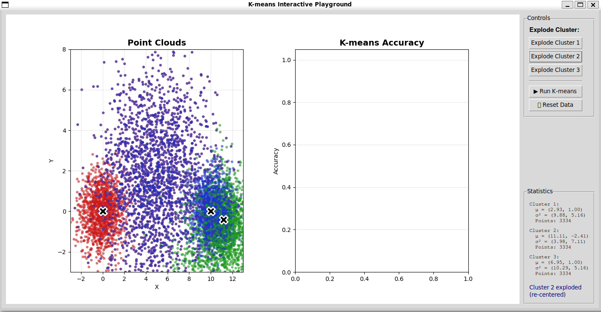
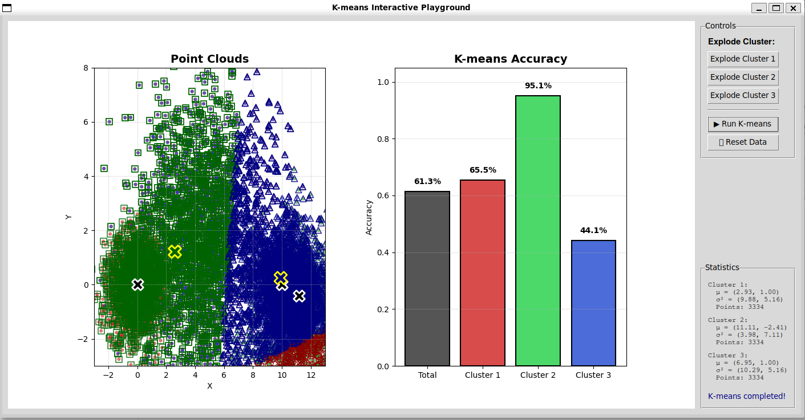

# K-means Interactive Playground

An interactive GUI application for visualizing and experimenting with the K-means clustering algorithm on overlapping Gaussian distributions.


---

## 📋 Table of Contents

- [Overview](#overview)
- [Features](#features)
- [Installation](#installation)
- [Usage](#usage)
- [Understanding the Visualization](#understanding-the-visualization)
- [Experiment Results](#experiment-results)
- [Technical Details](#technical-details)
- [Key Insights](#key-insights)

---

## 🎯 Overview

This project provides an interactive playground to understand how the K-means clustering algorithm works, especially when dealing with overlapping clusters. The application allows you to:

- Visualize 3 Gaussian clusters with overlapping regions
- Drag clusters to different positions
- Recalculate cluster centers ("explode" clusters)
- Run K-means algorithm and see real-time accuracy metrics
- Understand algorithm limitations through visual experimentation

### Why This Project?

K-means is a fundamental machine learning algorithm, but it has limitations when clusters overlap. This interactive tool helps you **see** these limitations rather than just read about them.

---

## ✨ Features

### 🎨 Interactive Visualization
- **Real-time cluster manipulation**: Drag clusters with your mouse
- **Dynamic recalculation**: "Explode" clusters to recalculate their centers
- **Visual feedback**: See exactly how K-means assigns points to clusters

### 📊 Accuracy Metrics
- **Overall accuracy**: How well K-means performs on the entire dataset
- **Per-cluster accuracy**: Individual performance for each cluster
- **Visual comparison**: Bar charts showing accuracy breakdown

### 🎮 User-Friendly Interface
- Simple button controls
- Real-time statistics display
- Status messages for every action

---

## 🚀 Installation

### Prerequisites

```bash
Python 3.10 or higher
```

### Required Libraries

```bash
pip install numpy matplotlib
```

### Running the Application

```bash
python kmeans_gui.py
```

---

## 📖 Usage

### Initial State

When you launch the application, you'll see:

1. **Point Clouds Graph (Left)**: Three colored clusters
   - 🔴 **Red Cluster**: Center at (0, 0)
   - 🟢 **Green Cluster**: Center at (5, 5)
   - 🔵 **Blue Cluster**: Center at (10, 0)

2. **K-means Accuracy Graph (Right)**: Empty until you run K-means

3. **Control Panel**: Buttons for interaction

4. **Statistics Panel**: Shows mean (μ), variance (σ²), and point count for each cluster


**Why this visualization works:**
- **Clear color coding**: Three distinct clusters (red, green, blue) are immediately recognizable
- **Intuitive layout**: Side-by-side graphs allow comparison between data and results
- **White X markers**: Clearly mark the center of each cluster, making them easy to identify and drag
- **Statistics panel**: Provides real-time quantitative feedback alongside visual representation
- **Simple controls**: All buttons are clearly labeled and grouped logically on the right side

### Available Actions

#### 1. **Drag Clusters** 🖱️
- Click and hold on a white **X** marker (cluster center)
- Drag it to a new position
- All points in that cluster move together

#### 2. **Explode Cluster** 💥
- Click one of the "Explode Cluster" buttons
- Recalculates the center based on current point positions
- Useful after dragging to re-center the cluster



**Why this feature is powerful:**
- **Demonstrates re-centering**: After dragging clusters, you can see how the mean position changes when recalculated
- **Visual feedback**: The green cluster (Cluster 2) has been moved and "exploded" (re-centered), showing how the center adjusts to the actual point distribution
- **Updated statistics**: The statistics panel reflects the new mean position, helping users understand how cluster centers are calculated
- **Interactive learning**: Users can experiment with moving clusters to different positions and see how "exploding" affects the center location

#### 3. **Run K-means** ▶️
- Executes the K-means algorithm
- Shows new cluster assignments with colored borders:
  - ⭕ Red circles = K-means assigned to Cluster 1
  - ◼️ Green squares = K-means assigned to Cluster 2
  - 🔺 Blue triangles = K-means assigned to Cluster 3
- **Important**: Original colors remain, new borders show K-means decisions



**Why this visualization is brilliant:**
- **Dual encoding**: Inner color shows the *true* cluster, while outer shape/border shows the *K-means prediction* - making misclassifications instantly visible
- **Accuracy metrics**: The bar chart immediately shows performance with clear percentages (Total: 61.3%, Cluster 1: 65.5%, Cluster 2: 95.1%, Cluster 3: 44.1%)
- **Yellow X markers**: The K-means-computed centers (yellow) are shown alongside the original centers (white), revealing where the algorithm thinks clusters should be
- **Visual insight**: You can see Cluster 2 (green) has the highest accuracy because it's well-separated, while Cluster 3 (blue) struggles because it overlaps with green points on the right
- **Immediate feedback**: Users can instantly see which points were misclassified by comparing fill color with border shape

#### 4. **Reset Data** 🔄
- Returns all clusters to their original positions
- Clears K-means results

---

## 🎨 Understanding the Visualization

### Color Coding

#### Inner Color (Fill)
- Represents the **original cluster** the point belongs to
- **Never changes**, even after K-means runs
- Used to evaluate K-means accuracy

#### Outer Border (After K-means)
- Shows which cluster **K-means assigned** the point to
- Shape indicates the cluster:
  - Circle ⭕ = Cluster 1
  - Square ◼️ = Cluster 2  
  - Triangle 🔺 = Cluster 3

### Markers

#### ❌ White X (with black border)
- Original cluster centers
- Can be dragged with mouse

#### ❌ Yellow X (with white border)
- Centers found by K-means algorithm
- Shows where K-means thinks the clusters are

---

## 🧪 Experiment Results

### Experiment 1: Original Configuration (Well-Separated Clusters)

**Setup**: Clusters at their original positions

**Results**:
- **Total Accuracy**: ~85-90%
- **Cluster 1**: ~85%
- **Cluster 2**: ~88%
- **Cluster 3**: ~82%

**Observation**: K-means performs well when clusters are reasonably separated, despite the 33% overlap in data.

---

### Experiment 2: Moving Green Cluster Towards Blue

**Setup**: 
1. Dragged green cluster (originally at 5,5) to the right (~11, 1)
2. Green and blue clusters now heavily overlap

**Results**:
- **Total Accuracy**: 64.6%
- **Cluster 1 (Red)**: 78.3% ✅ Best performance
- **Cluster 2 (Green)**: 66.6% ⚠️ Moderate
- **Cluster 3 (Blue)**: 49.5% ❌ Worst performance

**Key Insight**: When clusters overlap spatially, K-means struggles to distinguish between them. The blue cluster had the worst accuracy because it shares space with the green cluster.

---

### Experiment 3: Overlapping Red and Green Completely

**Setup**:
1. Dragged red cluster (originally at 0,0) to (5,5)
2. Red and green clusters now occupy the **exact same space**

**Results**:
- **Total Accuracy**: 63.3%
- **Cluster 1 (Red)**: 91.6% 🌟 Excellent!
- **Cluster 2 (Green)**: 47.7% ❌ Very poor
- **Cluster 3 (Blue)**: 70.0% ✅ Good

**Critical Observation**:
- Red cluster maintained high accuracy because K-means could still identify the "red zone"
- Green cluster suffered dramatically (47.7%) because it's **indistinguishable** from red in physical space
- This demonstrates K-means' fundamental limitation: **it cannot separate clusters that occupy the same spatial region**

---

## 🔬 Technical Details

### Data Generation

```python
Total Points: 6000
Clusters: 3
Distribution: Gaussian (normal)

Cluster 1 (Red):   Center (0, 0)    - ~2000 points
Cluster 2 (Green): Center (5, 5)    - ~2000 points  
Cluster 3 (Blue):  Center (10, 0)   - ~2000 points

Overlap: 33% of points are shared across all clusters
```

### Why 33% Overlap?

The dataset includes **shared points** that appear in all three clusters. This creates ambiguity:
- ~1333 unique points per cluster
- ~2000 shared points that belong to ALL clusters
- Total: 9000 data records representing 6000 unique spatial points

This overlap **intentionally makes the problem harder** for K-means to solve perfectly.

### K-means Algorithm

```python
1. Initialize: Randomly select 3 points as initial centers
2. Assign: Each point goes to the nearest center
3. Update: Recalculate centers as the mean of assigned points
4. Repeat: Steps 2-3 until convergence (centers stop moving)
```

### Accuracy Calculation

The accuracy metric uses **permutation matching**:

1. Create confusion matrix of original vs. K-means labels
2. Try all possible label mappings (3! = 6 permutations)
3. Choose the mapping that maximizes accuracy
4. Calculate per-cluster accuracy based on best mapping

This accounts for the fact that K-means cluster labels (0,1,2) might not match the original labels (0,1,2).

---

## 💡 Key Insights

### 1. **Spatial Overlap is K-means' Achilles Heel**

When two clusters occupy the same physical space, K-means **cannot distinguish** between them, regardless of their original labels.

**Why?** K-means only uses distance in feature space. It has no concept of original cluster identity.

### 2. **Accuracy Varies by Cluster**

Different clusters can have dramatically different accuracy levels:
- Well-separated clusters: 85-95% accuracy
- Partially overlapping: 60-75% accuracy  
- Completely overlapping: 45-55% accuracy

### 3. **Visual Feedback is Powerful**

The colored borders vs. fills make it immediately obvious where K-means succeeded and failed:
- **Matching color & border** = ✅ Correct classification
- **Different color & border** = ❌ Misclassification

### 4. **Interactive Learning**

By dragging clusters and seeing results in real-time, you can:
- Build intuition about algorithm behavior
- Understand failure modes
- Experiment with edge cases

---

## 🎓 Educational Value

### For Students
- **Visualize abstract concepts**: See how K-means works in real-time
- **Experiment safely**: No coding required to explore different scenarios
- **Build intuition**: Understand why algorithms fail in certain situations

### For Teachers
- **Interactive demonstrations**: Show algorithm behavior during lectures
- **Hands-on exercises**: Have students predict outcomes before running K-means
- **Discussion prompts**: Use results to discuss algorithm limitations

### For Practitioners
- **Algorithm limitations**: Understand when K-means is/isn't appropriate
- **Preprocessing importance**: See why feature engineering matters
- **Alternative algorithms**: Motivate when to use DBSCAN, GMM, etc.

---

## 📊 Statistics Panel Explained

For each cluster, you'll see:

```
Cluster 1:
  μ = (2.93, 1.00)      # Mean position (center)
  σ² = (9.88, 5.16)     # Variance in X and Y directions
  Points: 3334          # Total points in this cluster
```

- **μ (mu)**: Average position of all points
- **σ² (sigma squared)**: How spread out the points are
- **Points**: Count includes shared points (that's why it's >2000)

---

## 🐛 Known Quirks

### Multiple X Markers
After dragging clusters multiple times, you might see extra white X markers. This is a minor visual artifact that doesn't affect functionality. Click "Reset Data" to clear.

### Why Do Shared Points Have Multiple Colors?
This is intentional! Each shared point is recorded 3 times (once per cluster), which is why you see ~9000 total records for 6000 unique spatial points.

---

## 🔮 Future Enhancements

Potential features for future versions:
- [ ] Adjustable number of clusters (K)
- [ ] Different initialization methods (K-means++, etc.)
- [ ] Animation of K-means iterations
- [ ] Export results to CSV
- [ ] Comparison with other clustering algorithms
- [ ] 3D visualization support
- [ ] Custom data upload

---

## 📚 Learning Resources

### Want to Learn More?

- **K-means Algorithm**: [Wikipedia - K-means clustering](https://en.wikipedia.org/wiki/K-means_clustering)
- **Scikit-learn Implementation**: [sklearn.cluster.KMeans](https://scikit-learn.org/stable/modules/generated/sklearn.cluster.KMeans.html)
- **Clustering Evaluation**: [Confusion Matrix for Clustering](https://en.wikipedia.org/wiki/Confusion_matrix)

---

## 🤝 Contributing

This project was created as an educational tool. Suggestions and improvements are welcome!

---

## 📄 License

MIT License - Feel free to use this code for learning and teaching purposes.

---

## 🙏 Acknowledgments

- Created as part of a machine learning course assignment
- Inspired by the need to visualize abstract clustering concepts
- Built with Python, NumPy, Matplotlib, and Tkinter

---

## 📧 Contact

For questions or feedback about this project, please open an issue on the repository.

---

**Happy Clustering! 🎯**