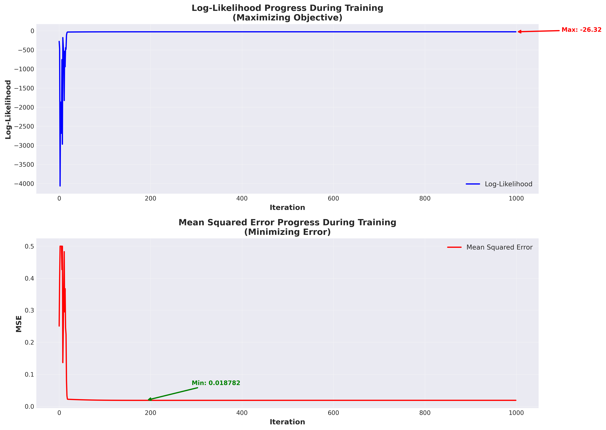
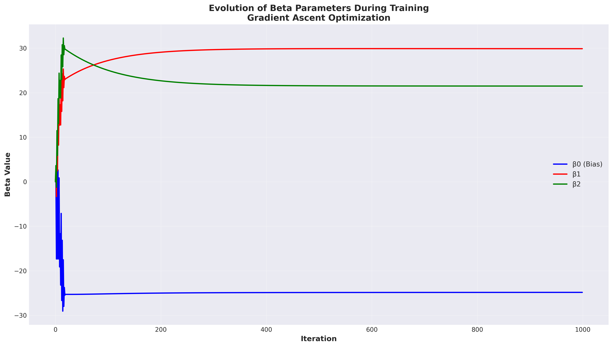
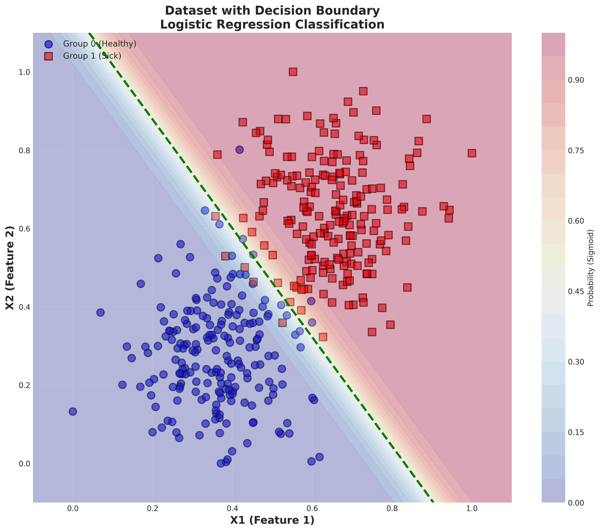
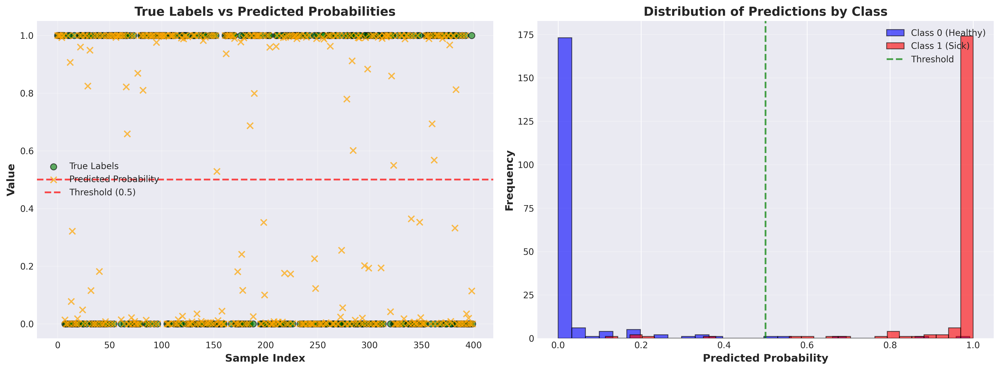

# Logistic Regression - Binary Classification
## Simple Explanations for Everyone 👶

---

## 📚 Table of Contents
1. [What Does This Project Do?](#what-does-this-project-do)
2. [Understanding the Graphs](#understanding-the-graphs)
3. [Understanding the Table](#understanding-the-table)
4. [Questions & Answers](#questions--answers)
5. [How to Run](#how-to-run)
6. [Results Summary](#results-summary)

---

## 🎯 What Does This Project Do?

**Simple Answer:** It's a smart program that learns to tell if someone is healthy or sick!

### The Challenge:
- You have 400 people
- 200 are healthy
- 200 are sick
- The computer needs to learn the pattern

### How it Works:
1. **Give the computer data** about each person (2 features: X1 and X2)
2. **Tell it the correct answers** (healthy or sick)
3. **Let it practice** 1000 times
4. **Test how well it learned**

### The Result:
**97.5% accuracy!** The model correctly identifies 390 out of 400 people! 🎉

---

## 📊 Understanding the Graphs

### 🔷 Graph 1: Training Progress



#### Top Graph (Blue Line) - Log-Likelihood

**What is Log-Likelihood?**
It measures how confident the model is about its predictions.

**Think of it like test scores:**
- **Low score (-4000)**: Model is guessing, not confident
- **High score (-26)**: Model is confident and correct!

**Example - Iteration 0 (Model is Dumb):**
```
Person 1 (actually healthy):
  Model says: "55% chance he's healthy"
  → Not confident! Just guessing!
  → Log-Likelihood = -4000 (very low)

Person 2 (actually sick):
  Model says: "52% chance he's sick"  
  → Almost a coin flip!
  → Log-Likelihood stays low
```

**Example - Iteration 999 (Model is Smart):**
```
Person 1 (actually healthy):
  Model says: "99.97% chance he's healthy!"
  → Very confident AND correct!
  → Log-Likelihood = -26 (high!)

Person 2 (actually sick):
  Model says: "99.99% chance he's sick!"
  → Almost certain AND correct!
  → Log-Likelihood stays high
```

#### Bottom Graph (Red Line) - Mean Squared Error

**What is Error?**
How much the model's predictions differ from reality.

- **Start**: Error = 0.5 (bad!)
- **End**: Error = 0.019 (excellent!)

**Lower error = Better model!**

---

### 🔷 Graph 2: Beta Evolution



#### What is Beta (β)?

**Beta are the weights in the formula!**

Think of it like a recipe:
```
Cake taste = (2 × flour) + (3 × sugar) + (1 × eggs)
```
The numbers 2, 3, 1 are the "weights" (how important each ingredient is)

#### In Our Model:

```
Decision = (β0 × 1) + (β1 × X1) + (β2 × X2)

If Decision > 0 → Sick
If Decision < 0 → Healthy
```

#### The Values We Found:
- **β0 = -25** (starting point / bias)
- **β1 = +30** (X1 is VERY important!)
- **β2 = +21** (X2 is also important!)

---

#### Real Example with Numbers:

**Person 1:** X1=0.2, X2=0.3 (low values)
```
Decision = (-25 × 1) + (30 × 0.2) + (21 × 0.3)
        = -25 + 6 + 6.3
        = -12.7 (negative!)

Result: HEALTHY ✓
```

**Person 2:** X1=0.8, X2=0.7 (high values)
```
Decision = (-25 × 1) + (30 × 0.8) + (21 × 0.7)
        = -25 + 24 + 14.7
        = +13.7 (positive!)

Result: SICK ✓
```

#### What Does the Graph Show?

The three colored lines show how β0, β1, and β2 changed during training:
- **Blue line (β0)**: Started at 0, dropped to -25
- **Red line (β1)**: Started at 0, jumped to +30
- **Green line (β2)**: Started at 0, rose to +21

**They stabilize after ~200 iterations = Model found the answer!**

---

### 🔷 Graph 3: Decision Boundary



#### This is the MOST Important Graph!

**What You See:**
- 🔵 **Blue circles** = Healthy people (Group 0)
- 🔴 **Red squares** = Sick people (Group 1)
- **Green dashed line** = The boundary the model found

#### Background Colors:
- **Blue background** = Model thinks "definitely healthy" (probability near 0)
- **Red background** = Model thinks "definitely sick" (probability near 1)
- **White/yellow** = Model is unsure (probability near 0.5)

#### Understanding Mistakes:

**✅ Correct Predictions:**
- 🔵 on blue background = Healthy person correctly identified
- 🔴 on red background = Sick person correctly identified

**❌ Wrong Predictions:**
- 🔵 on red background = Healthy person wrongly classified as sick
- 🔴 on blue background = Sick person wrongly classified as healthy

**Only 10 mistakes out of 400!**

#### Example:
```
If you see a blue circle on red background:
  → The person is actually healthy (blue)
  → But the model thinks they're sick (red area)
  → This is a MISTAKE!
```

---

### 🔷 Graph 4: Predictions Comparison



#### Left Graph: Scatter Plot

**What You See:**
- **Green circles** = True labels (0 or 1)
- **Orange X's** = Model's probabilities (between 0 and 1)
- **Red dashed line** = Decision threshold (0.5)

**Good Model:**
Orange X's are very close to green circles!

#### Right Graph: Histogram

Shows the distribution of predictions:

- **Blue bars (left)**: All healthy people
  - Model gives them probabilities near 0 ✓
  
- **Red bars (right)**: All sick people
  - Model gives them probabilities near 1 ✓
  
- **Green line (middle)**: Threshold at 0.5

**The gap between blue and red = Excellent model!**

---

## 📋 Understanding the Table

### What's in the Excel File?

**400 rows** (one for each person) and **8 columns**:

| Column | Meaning | Example |
|--------|---------|---------|
| **Unnamed: 0** | Row number | 0, 1, 2, 3... |
| **X0 (Bias)** | Always 1 | 1.0 |
| **X1** | Feature 1 (0-1) | 0.695 = high visits |
| **X2** | Feature 2 (0-1) | 0.582 = medium sugar |
| **True Label (y)** | Reality (0/1) | 1 = sick |
| **Prediction (Sigmoid)** | Probability (0-1) | 0.9998 = 99.98% sick |
| **Binary Prediction** | Decision (0/1) | 1 = model says: sick |
| **Absolute Error** | How wrong | 0.0002 = almost perfect |

---

### 📊 Column Explanations:

#### 1. X0 (Bias) - Always 1
```
1, 1, 1, 1, 1...
```
Needed for the formula. Don't worry about it!

#### 2. X1 - First Feature (0 to 1)
```
0.695, 0.607, 0.599...
```
**Example:** Number of doctor visits per year
- 0.2 = few visits
- 0.8 = many visits

#### 3. X2 - Second Feature (0 to 1)
```
0.582, 0.724, 0.783...
```
**Example:** Blood sugar level
- 0.3 = low sugar
- 0.7 = high sugar

#### 4. True Label (y) - The Truth! ⭐
```
0 = Healthy
1 = Sick
```
This is what the model needs to learn!

#### 5. Prediction (Sigmoid) - Model's Thought
```
0.9998 = "I'm 99.98% sure they're sick"
0.0001 = "I'm 99.99% sure they're healthy"
0.5000 = "I have no idea!"
```

#### 6. Binary Prediction - Final Decision
```
If Prediction >= 0.5 → Binary = 1 (sick)
If Prediction < 0.5  → Binary = 0 (healthy)
```

#### 7. Absolute Error - Mistake Size
```
|True Label - Prediction|

Small error (0.001) = almost perfect
Large error (0.8) = big mistake!
```

---

### 🎯 Real Examples from the Table:

#### 😊 Person 6 - Perfect!
```
X1 = 1.000 (highest!)
X2 = 0.792 (high)
True Label = 1 (sick)
Prediction = 1.0000 (100%!)
Binary = 1 (model says: sick)
Error = 0.0000000003

Model is 100% confident and CORRECT!
```

#### 😊 Person 9 - Perfect (Other Direction)!
```
X1 = 0.266 (very low)
X2 = 0.065 (very low)
True Label = 0 (healthy)
Prediction = 0.00000019 (basically 0%!)
Binary = 0 (model says: healthy)
Error = 0.00000019

Model is ~100% confident and CORRECT!
```

#### 😐 Person 12 - Uncertain but Correct
```
X1 = 0.571 (medium)
X2 = 0.468 (medium)
True Label = 1 (sick)
Prediction = 0.9069 (91% sick)
Binary = 1 (model says: sick)
Error = 0.093

Not 99% confident, but still correct!
```

#### 😟 Person 77 - MISTAKE!
```
X1 = 0.597 (medium-high)
X2 = 0.414 (medium)
True Label = 0 (actually HEALTHY!)
Prediction = 0.8687 (87% sick)
Binary = 1 (model says: sick)
Error = 0.87

Model was 87% confident... but WRONG!
Why? X1 and X2 look like a sick person
But this person was healthy - an outlier!
```

#### 😟 Person 398 - BIG MISTAKE!
```
X1 = 0.382 (low)
X2 = 0.529 (medium)
True Label = 1 (actually SICK!)
Prediction = 0.1141 (only 11% sick)
Binary = 0 (model says: healthy)
Error = 0.89

Model thought they were healthy... but WRONG!
Why? X1 is very low, looks healthy
But this person was sick - rare case!
```

---

## ❓ Questions & Answers

### Q1: What is Log-Likelihood?

**A:** It measures how confident the model is.

**Student studying for a test:**
```
Try 1: "I think the answer is 54... maybe?"
       → Not confident, low likelihood

Try 10: "I'm 99% sure the answer is 56!"
        → Very confident, high likelihood
```

**In the model:**
- Low (-4000): Guessing, not sure
- High (-26): Confident and correct!

---

### Q2: How does the model improve?

**A:** It sees the correct answers and learns from mistakes!

**Like a student with an answer key:**

**Iteration 0 (Dumb):**
```
Person 1 (healthy):
  Model guesses: "55% healthy"
  Checks answer: "He's healthy!"
  Model: "Oops, I should be MORE confident"
  → Adjusts Beta
```

**Iteration 999 (Smart):**
```
Person 1 (healthy):
  Model says: "99.97% healthy!"
  Checks answer: "He's healthy!"
  Model: "Yes! I'm right AND confident!"
  → Keeps Beta
```

**The model practices 1000 times, checking answers each time!**

---

### Q3: What is Beta?

**A:** Beta are the weights that tell the model what's important.

**Recipe analogy:**
```
Cake = (2 × flour) + (3 × sugar) + (1 × eggs)
       ↑           ↑            ↑
    weights that make the recipe work
```

**In our model:**
```
Decision = (-25 × 1) + (30 × X1) + (21 × X2)
            ↑β0       ↑β1         ↑β2

β1 = 30 is bigger → X1 is MORE important
β2 = 21 is smaller → X2 is LESS important
```

---

### Q4: Blue circle on red background - is this a mistake?

**A:** YES! Exactly!

```
🔵 = Person is actually healthy
Red background = Model thinks "sick"

This is one of the 10 mistakes!
```

**Why does this happen?**
The person's X1 and X2 values are high (look sick), but they're actually healthy - they're an outlier!

---

### Q5: How does the model know it's improving?

**A:** It compares its predictions to the correct answers!

**Example:**

**Bad prediction:**
```
Model: "I think they're sick (80%)"
Reality: They're healthy
Score: PENALTY! Log-Likelihood drops
```

**Good prediction:**
```
Model: "I think they're healthy (99%)"
Reality: They're healthy  
Score: REWARD! Log-Likelihood rises
```

**The model sees its score after every iteration and adjusts to make it higher!**

---

## 🚀 How to Run

### Prerequisites:
```bash
# Activate virtual environment
source venv_global/bin/activate

# Install packages
pip install numpy pandas matplotlib seaborn openpyxl --break-system-packages
```

### Run:
```bash
python main.py
```

### Output Files:
- `results_table.csv` - All 400 predictions
- `results_table.xlsx` - Same in Excel
- `decision_boundary.png` - Graph 3
- `predictions_comparison.png` - Graph 4
- `training_progress.png` - Graph 1
- `beta_evolution.png` - Graph 2

---

## 📊 Results Summary

### Performance:
- **Total People**: 400 (200 healthy + 200 sick)
- **Correct Predictions**: 390
- **Mistakes**: 10
- **Accuracy**: 97.5% 🎉

### Final Beta Values:
```
β0 (Bias) = -25.00
β1        = +30.00  (X1 is very important!)
β2        = +21.00  (X2 is important!)
```

### Training:
- **Iterations**: 1000
- **Learning Rate**: 0.1
- **Final Log-Likelihood**: -26.32 (excellent!)
- **Final Error**: 0.019 (very low!)

### Convergence:
- Model learned fast in first 200 iterations
- Stabilized around iteration 400
- Remained stable for remaining 600 iterations

---

## 🎓 Key Takeaways

1. **Log-Likelihood** = How confident the model is
   - Low: Guessing
   - High: Confident and correct

2. **Beta (β)** = Weights that make the decision
   - Like ingredients in a recipe
   - The model finds the best values

3. **Sigmoid** = Converts formula result to probability (0-1)
   - Near 0 = healthy
   - Near 1 = sick

4. **The Model Learns** by:
   - Making predictions
   - Checking correct answers
   - Adjusting Beta to improve
   - Repeating 1000 times

5. **97.5% Accuracy** = Only 10 mistakes out of 400!

---

## 🎯 The Big Picture

**What happened:**
1. Started with random Beta → Model was dumb
2. Trained for 1000 iterations → Model learned
3. Found optimal Beta → Model is smart
4. Achieved 97.5% accuracy → Model is excellent!

**The model learned to separate healthy from sick people using just 2 features (X1 and X2) and a simple formula!**

**This is Machine Learning! 🤖✨**

---

## 📝 Files in This Project

- `main.py` - Main script (run this!)
- `logistic_regression.py` - Model implementation
- `visualizations.py` - Graphing functions
- `README.md` - This file
- `results_table.csv` - Results
- `results_table.xlsx` - Results (Excel)
- `*.png` - 4 visualization graphs

---

**Project Complete! 🎉**

*Logistic Regression made simple - now you understand it!*